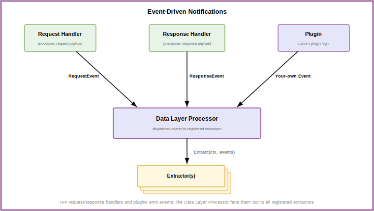

# IPP Architecture

## Table of Contents

- [Overview](#overview)
- [Design Principles](#design-principles)
- [ext-proc Integration](#ext-proc-integration)
- [Processing Pipeline](#processing-pipeline)
  - [Profiles](#profiles)
  - [Profile Picker](#profile-picker)
  - [Pre- and Post-Processing](#pre--and-post-processing)
- [Model Selection](#model-selection)
- [Data Layer](#data-layer)
  - [Event-Driven Updates](#event-driven-updates)
  - [Collection Mechanism](#collection-mechanism)
- [Multi-Pool Routing](#multi-pool-routing)
- [Relationship to the Router (EPP)](#relationship-to-the-router-epp)
- [References](#references)

---

## Overview

The **Inference Payload Processor (IPP)** is a pluggable service that inspects and mutates inference
request and response payloads in the llm-d data plane. It runs alongside the inference gateway's Proxy
(e.g. Envoy) and is invoked over Envoy's [External Processing (ext-proc)] protocol on each HTTP
lifecycle event.

IPP is a general, payload-aware framework: any request- or response-shaping logic can be expressed as
a plugin and composed into the pipeline. Its flagship use is **payload-aware routing** — reading
signals such as the model name from the request body and injecting headers so a single Gateway
endpoint can serve many base models and LoRA adapters — but that is one application of the framework,
not its boundary.

A request flows through the system as follows:

<p align="center">
  
</p>

1. A **client** sends an inference request to the Proxy.
2. The **Proxy** invokes IPP over ext-proc.
3. **IPP** runs the request through its configured plugin pipeline and returns any mutations (headers, body edits).
4. The **Proxy** applies the mutations and routes to the selected destination.
5. If the selected destination is [InferencePool], the **EPP** picks the optimal pod within that pool.
6. The **model server** processes the request; the response travels back through the Proxy, where IPP may process it again (including response headers/body mutations) before it reaches the client.

---

## Design Principles

IPP follows the design principles established by the [ModelSelector proposal] and the broader llm-d
framework conventions:

- **The framework is opinion-free; plugins hold the opinions.** The core defines the pipeline and the
  extension points; concrete behavior lives in plugins.
- **Clear API surface.** Entry and exit points are defined by the framework, forming a stable contract
  between the Proxy, the pipeline, and the plugins.
- **Pluggable everything.** Request processing, response processing, model selection, profile
  selection, and data collection are all swappable via configuration.
- **Explicit state boundaries.** Per-request state is shared across plugins through an in-memory cycle
  state for the duration of a single request; cross-request state lives in the data layer.

---

## ext-proc Integration

IPP implements the Envoy [External Processing (ext-proc)] gRPC API. The Proxy streams HTTP lifecycle
events — request headers, request body, request trailers, and the corresponding response events — to
IPP, which replies with mutations. IPP requires `FULL_DUPLEX_STREAMED` body mode so it can observe and
mutate full request/response bodies.

Each event type can be enabled or disabled independently (see [Configuration]). Every enabled event is
an extra network hop between the Proxy and IPP, so deployments should enable only the events their
configured plugins actually consume — for example, a routing-only deployment can disable all response
events.

IPP is deployed **once per Gateway**. The Helm chart wires the ext-proc integration into the Proxy
automatically for the selected provider (Istio `EnvoyFilter`, GKE `GCPRoutingExtension`); see
[Configuration] for the generated resources.

---

## Processing Pipeline

IPP executes plugins in a fixed sequence of stages:

```
PreProcessor Plugins → ProfilePicker → Profile Request Plugins → [Model Server] → Profile Response Plugins → PostProcessor Plugins
```

| Stage | Scope | Purpose |
|-------|-------|---------|
| **PreProcessor Plugins** | Global | Process the request before ProfilePicker. This may include a subset of request plugins that should always run, no matter which profile is selected. |
| **ProfilePicker** | Global | Selects which profile to execute for the request. |
| **Profile Request Plugins** | Per-profile | Process the request before it is routed. |
| **Profile Response Plugins** | Per-profile | Process the response after the model server replies. |
| **PostProcessor Plugins** | Global | Process the response after the model server replies. This may include a subset of response plugins that should always run, no matter which profile is selected. |

The pipeline is declared in a `PayloadProcessorConfig`: all plugins are instantiated under a top-level
`plugins` list and then referenced by name within other sections. See [Plugins] for the full configuration
model and [Configuration] for the API schema.

> [!NOTE]
> The config API also defines global **PreProcessing** and **PostProcessing** stages — intended to run
> for every request before profile selection and after the response plugins. These are reserved
> extension points: they are accepted in the configuration but are not yet invoked by the request path.

### Profiles

A **profile** is a named set of `request` and `response` plugin references. Exactly one profile runs
per request. Splitting behavior across profiles lets a single IPP deployment apply different processing
logic to different classes of traffic (e.g. a lightweight header-extraction profile vs. a full
model-selection profile).

A profile's `request` list may contain both request-processor plugins and model-selector plugins
(Filter / Scorer / Picker); the config loader routes each reference to the right extension point based
on the interface the plugin implements.

### Profile Picker

When more than one profile is configured, a **profile picker** plugin may inspect the request (headers,
body), system state (e.g., datastore) or any other parameter, and chooses which profile to run. When exactly one profile is defined and no picker is
configured, the built-in [`single-profile-picker`] is enabled automatically.

### Pre- and Post-Processing

**PreProcessing** and **PostProcessing** are reserved global extension points in the config API —
intended for logic common to all requests, before profile selection and after the response plugins.
They are not yet wired into the request path, and there are no in-tree pre/post processors.

---

## Model Selection

The **ModelSelector** framework selects a *model* to serve a request — as opposed to the EPP, which
selects an *endpoint*. It is invoked by the `model-selector` request plugin and runs a three-phase
pipeline:

```
Filter → Score → Pick
```

- **Filter** — Removes candidate models that cannot serve the request (e.g. unavailable or rate-limited). If filtering leaves zero candidates, the framework returns an error to the client.
- **Score** — Each remaining candidate is scored, conventionally in `[0, 1]`. Multiple scorers combine via per-scorer weights configured in the profile.
- **Pick** — Exactly one picker selects the final model from the scored candidates.

The selected model is written into the request body, after which the request continues through the
normal pipeline exactly as if the client had requested that model directly. A typical use is sending
`{"model": "auto"}` and letting cost, load or latency aware scorers (or any combination of them) choose the concrete model. The framework
and its phases are specified in the [ModelSelector proposal]; the available plugins are listed in
[Plugins].

---

## Data Layer

The **data layer** maintains cross-request state that other plugins (e.g., Scorer, Filter, ProfilePicker)
consume to make data-driven decisions.
It is populated through two mechanisms that run independently from the request processing pipeline:

- **Event-driven notifications** — Events generated during request/response processing are consumed
  asynchronously by **Extractors** that update the datastore.
- **Collection mechanism** — **Collectors** and **Datasources** pull configuration and signals from
  external resources, either on a timer or through a watch.

Data-layer plugins are registered under the `datalayer` section of the config and are **never** part of
a profile's `request` or `response` plugin lists. This is how runtime signals such as in-flight request
counts become available to scoring decisions without adding latency to the request path.

### Event-Driven Notifications


Events are designed to offload data layer processing asynchronously, away from the time-critical
request/response pipeline.
<p align="center">
  
</p>

The response/request pipeline processor fires events at two points in the request lifecycle:
a `RequestEvent` after the request plugin stage completes, and a `ResponseEvent` at the start of
response body handling — before the response plugins run. Beyond these, any plugin can fire additional
events at any time by calling
`Handle.EventNotifier().Notify()` — the [`EventNotifier`] interface exposed to every plugin through its
IPP handle.

Events are delivered non-blocking on a buffered channel. A dedicated event-loop goroutine reads from
this channel and fans each event out to all registered **Extractors** by calling
[`Extractor.Extract(ctx, events)`][`datasource.Extractor`]. Each extractor receives every event and is
responsible for filtering to only the event types it cares about.

### Collection Mechanism

**Collectors** are designed for periodic polling of data. Each collector implements
[`Collector.Poll(ctx)`][`datasource.Collector`] and declares its own polling interval via
`CollectorFrequency()`. The data layer processor drives each collector in a dedicated goroutine on a
ticker at the configured frequency, with an initial random jitter across collectors to avoid
thundering-herd startup spikes.

**Datasources** are designed for watcher-based and other custom collection mechanisms that do not fit
the periodic-poll model. A datasource implements [`DataSource.Start(ctx)` / `DataSource.Stop()`][`datasource.DataSource`] —
the processor starts it in a dedicated goroutine at startup and signals it to stop on shutdown. A
datasource typically performs an initial synchronization and then enters a watch loop (e.g. a filesystem
watcher, a Kubernetes informer, or any other event-driven source) to keep the datastore in sync as the
external source changes.


---

## Multi-Pool Routing

Multi-pool routing is IPP's flagship capability: serving multiple LLMs — and their LoRA adapters —
behind a single Gateway endpoint.

<p align="center">
  
</p>

Each [InferencePool] serves one base model. Clients call a single OpenAI-compatible endpoint and name
the model in the request body. IPP extracts that name, maps a LoRA adapter back to its base model when
needed, and injects a routing header (e.g. `X-Gateway-Base-Model-Name`). The Proxy's `HTTPRoute` rules
match on that header to select the correct pool.

This pattern supports:

- **Multiple base models** — Different pools for different architectures (e.g. Qwen for chat, DeepSeek for reasoning).
- **LoRA adapters** — Many fine-tuned adapters served by one base-model pool, with IPP mapping adapter names to their base.
- **A unified API endpoint** — One endpoint for all models, following the OpenAI API convention.

The model-name-to-base-model mapping is supplied through labeled ConfigMaps; the routing header and
`HTTPRoute` wiring are detailed in [Configuration].

---

## Relationship to the Router (EPP)

When IPP is used for routing, it and the EPP play complementary roles:

| | IPP | EPP (llm-d Router) |
|---|-----|--------------------|
| **Question answered** | Which **pool** serves this request? | Which **pod** within the pool? |
| **Granularity** | Pool-level | Endpoint-level |
| **Signal** | Request/response payload (model name, body fields) | InferencePool state (KV-cache, load, priority) |
| **Integration** | ext-proc, before routing | ext-proc, backend of an InferencePool |

A request first passes through IPP (which selects the pool via header injection) and then the EPP
(which selects the endpoint within that pool). They are configured and deployed independently.

---

## References

- [Configuration] — Full configuration reference.
- [Plugins] — In-tree plugin reference and pipeline configuration model.
- [Creating a Plugin](create_new_plugin.md) — Tutorial for writing a custom plugin.
- [ModelSelector proposal] — Design of the model-selection framework.
- [llm-d Router] — The router (EPP) that performs endpoint-level routing.
- [External Processing (ext-proc)] — The Envoy protocol IPP implements.

[Configuration]: configuration.md
[Plugins]: plugins.md
[ModelSelector proposal]: proposals/043-model-selection-framework/README.md
[`single-profile-picker`]: plugins.md#profile-picker-plugins
[llm-d Router]: https://github.com/llm-d/llm-d-router
[InferencePool]: https://gateway-api-inference-extension.sigs.k8s.io
[External Processing (ext-proc)]: https://www.envoyproxy.io/docs/envoy/latest/configuration/http/http_filters/ext_proc_filter
[`EventNotifier`]: ../pkg/framework/interface/datalayer/types.go
[`datasource.Extractor`]: ../pkg/framework/interface/datalayer/datasource/types.go
[`datasource.Collector`]: ../pkg/framework/interface/datalayer/datasource/types.go
[`datasource.DataSource`]: ../pkg/framework/interface/datalayer/datasource/types.go
